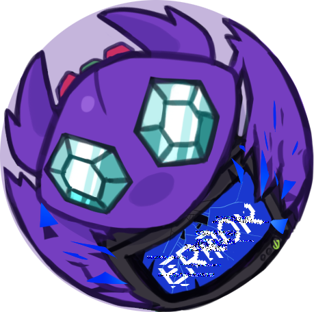

# SableyeBot3 is no longer receiving updates.  [The new, actively maintained repo can be found here](https://github.com/Stalruth/SableyeBot4)

#  
# SableyeBot
### Competitive Pokemon Discord bot

## [Add SableyeBot to your server](https://discord.com/api/oauth2/authorize?client_id=211522070620667905&permissions=0&scope=bot%20applications.commands)

## Installation
SableyeBot requires NodeJS 10+. In order to run your own local copy of SableyeBot, you need to perform a few steps.

1. Clone this repository, including the entire [Pokemon-Showdown](https://github.com/Zarel/Pokemon-Showdown) repository.
2. Rename `config.js.example` to `config.js` and fill out the empty fields and/or change the default values.
3. Go into the Pokemon-Showdown repository and run `npm run build`

If the steps above are performed correctly, you should be able to run `node index.js` and the bot will launch.

Yes, these instructions hurt my soul too. But it's easy and it works...

## Issues
If you encounter any bugs or need help, create an issue on the issue tracker. Please include:

 * A description of the bug
 * Steps to reproduce this bug
 * Expected versus actual behavior
 * Screenshots and/or gifs, if necessary
 * Bot version and/or date observed
 * Any other additional information
 
## Contributing
Want to help out? Fork this repository, make your changes, and send a pull request.
Do not worry too much over styling--I will look over your code and may change some lines anyways.

## Credits
 * [unlucky4ever's RuneCord bot](https://github.com/unlucky4ever/RuneCord), which SableyeBot is heavily based off of.
 * [Zarel's PokemonShowdown](https://github.com/Zarel/Pokemon-Showdown), whose databases SableyeBot parses.
